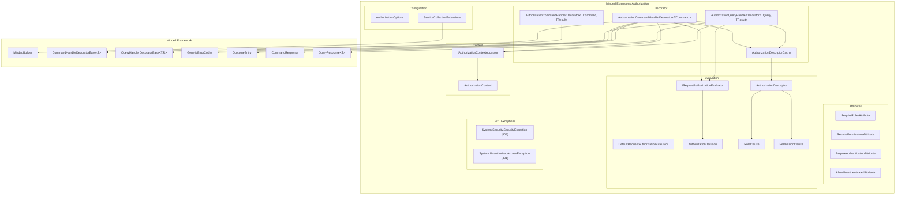
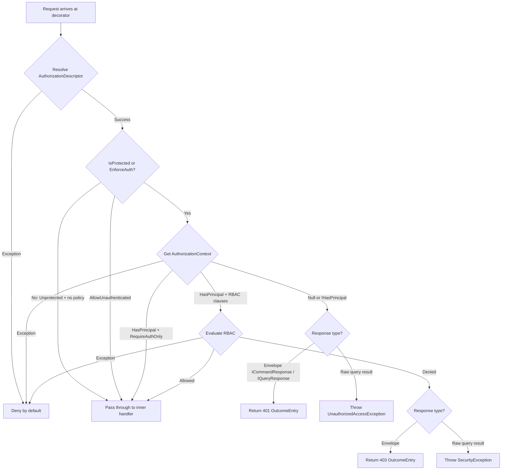

# Design Document: RBAC Decorator Extension

## Overview

This design describes a Role-Based Access Control (RBAC) decorator extension for the Minded framework. The extension adds authorization enforcement to the existing command/query decorator pipeline through attributes, a pluggable evaluator, and an abstracted authentication context.

The core flow: attributes on command/query classes declare RBAC requirements → at startup, attributes are validated and compiled into cached descriptors → at runtime, decorators resolve the caller's context via `IAuthorizationContextAccessor`, evaluate it against the descriptor using `IRequestAuthorizationEvaluator`, and short-circuit with appropriate error codes (401/403) when denied.

Key design decisions:
- **Authentication-first**: The decorator checks `HasPrincipal` before any RBAC evaluation, producing distinct 401 vs 403 error codes.
- **Deny-by-default**: Any exception in the authorization pipeline results in denial, never accidental access.
- **Single OutcomeEntry per denial**: No detail leakage about which roles/permissions were missing.
- **Descriptor caching**: `ConcurrentDictionary<Type, AuthorizationDescriptor>` ensures reflection happens at most once per request type.
- **Follows existing patterns**: Registration via `MindedBuilder` extension methods, options classes with `GetEffective*()` methods, decorator base classes, `TypeDescriptor.GetAttributes` for attribute detection.

## Architecture



### Decorator Pipeline Position

```
Command Pipeline:  Validation → Transaction → Authorization → Logging → Exception → Handler
Query Pipeline:    Validation → Cache → Authorization → Logging → Exception → Handler
```

The authorization decorator sits after validation (so invalid requests are rejected first) and before logging (so authorized requests are logged). This matches Requirement 18.

### Request Processing Flow



## Components and Interfaces

### Attributes (Minded.Extensions.Authorization.Attributes)

#### RequireRolesAttribute

```csharp
[AttributeUsage(AttributeTargets.Class, AllowMultiple = true, Inherited = true)]
public class RequireRolesAttribute : Attribute
{
    public string[] Roles { get; }
    public AuthorizationMatch Match { get; set; } = AuthorizationMatch.All;
    public int Minimum { get; set; } = 0;

    public RequireRolesAttribute(params string[] roles) => Roles = roles;
}
```

#### RequirePermissionsAttribute

```csharp
[AttributeUsage(AttributeTargets.Class, AllowMultiple = true, Inherited = true)]
public class RequirePermissionsAttribute : Attribute
{
    public string[] Permissions { get; }
    public AuthorizationMatch Match { get; set; } = AuthorizationMatch.All;
    public int Minimum { get; set; } = 0;

    public RequirePermissionsAttribute(params string[] permissions) => Permissions = permissions;
}
```

#### RequireAuthenticationAttribute

```csharp
[AttributeUsage(AttributeTargets.Class, AllowMultiple = false, Inherited = true)]
public class RequireAuthenticationAttribute : Attribute { }
```

#### AllowUnauthenticatedAttribute

```csharp
[AttributeUsage(AttributeTargets.Class, AllowMultiple = false, Inherited = true)]
public class AllowUnauthenticatedAttribute : Attribute { }
```

#### AuthorizationMatch Enum

```csharp
public enum AuthorizationMatch
{
    All,      // Every item must be present
    Any,      // At least one item must be present
    AtLeast,  // At least Minimum items must be present
    None      // None of the items may be present
}
```

### Context (Minded.Extensions.Authorization)

#### AuthorizationContext

```csharp
public class AuthorizationContext
{
    public bool HasPrincipal { get; }
    public IReadOnlyCollection<string> Roles { get; }
    public IReadOnlyCollection<string> Permissions { get; }

    public AuthorizationContext(bool hasPrincipal, 
        IReadOnlyCollection<string> roles = null, 
        IReadOnlyCollection<string> permissions = null)
    {
        HasPrincipal = hasPrincipal;
        Roles = roles ?? Array.Empty<string>();
        Permissions = permissions ?? Array.Empty<string>();
    }
}
```

#### IAuthorizationContextAccessor

```csharp
public interface IAuthorizationContextAccessor
{
    AuthorizationContext Current { get; }
}
```

The accessor is the sole authentication touchpoint. The decorator never calls any auth provider directly. Consumers implement this interface to bridge their authentication mechanism (JWT, cookies, API keys, etc.) to the authorization system.

### Evaluation (Minded.Extensions.Authorization)

#### AuthorizationDescriptor

```csharp
public sealed class AuthorizationDescriptor
{
    public bool IsProtected { get; }
    public bool AllowUnauthenticated { get; }
    public bool RequireAuthenticationOnly { get; }
    public IReadOnlyList<RoleClause> RoleClauses { get; }
    public IReadOnlyList<PermissionClause> PermissionClauses { get; }
}
```

#### RoleClause / PermissionClause

```csharp
public sealed class RoleClause
{
    public IReadOnlyList<string> Roles { get; }
    public AuthorizationMatch Match { get; }
    public int Minimum { get; }
}

public sealed class PermissionClause
{
    public IReadOnlyList<string> Permissions { get; }
    public AuthorizationMatch Match { get; }
    public int Minimum { get; }
}
```

Both are immutable after construction. The descriptor stores normalized (trimmed) values for comparison but preserves originals in the attribute for diagnostics.

#### AuthorizationDecision

```csharp
public sealed class AuthorizationDecision
{
    public bool Allowed { get; }
    internal AuthorizationDecisionReason Reason { get; }

    public static AuthorizationDecision Allow() => new(true, AuthorizationDecisionReason.Allowed);
    public static AuthorizationDecision Deny() => new(false, AuthorizationDecisionReason.Denied);
    public static AuthorizationDecision NoPrincipal() => new(false, AuthorizationDecisionReason.NoPrincipal);
}

internal enum AuthorizationDecisionReason
{
    Allowed,
    Denied,
    NoPrincipal
}
```

#### IRequestAuthorizationEvaluator

```csharp
public interface IRequestAuthorizationEvaluator
{
    AuthorizationDecision Evaluate(Type requestType, AuthorizationDescriptor descriptor, AuthorizationContext context);
}
```

#### DefaultRequestAuthorizationEvaluator

The default implementation:
1. Checks `context.HasPrincipal` — returns `NoPrincipal()` if false
2. If `descriptor.RequireAuthenticationOnly` and no RBAC clauses — returns `Allow()`
3. Evaluates all role clauses (implicit AND): each clause must pass per its `Match` mode
4. Evaluates all permission clauses (implicit AND): each clause must pass per its `Match` mode
5. Returns `Allow()` if all pass, `Deny()` otherwise

Match evaluation per clause:
- **All**: every item in the clause must exist in the context's collection
- **Any**: at least one item must exist
- **AtLeast**: at least `Minimum` items must exist
- **None**: zero items may exist

Comparison uses `StringComparer.OrdinalIgnoreCase` with trimmed values.

### Descriptor Cache

```csharp
internal static class AuthorizationDescriptorCache
{
    private static readonly ConcurrentDictionary<Type, AuthorizationDescriptor> _cache = new();

    public static AuthorizationDescriptor GetOrCreate(Type requestType) =>
        _cache.GetOrAdd(requestType, Compile);

    private static AuthorizationDescriptor Compile(Type requestType) { /* reflection logic */ }
}
```

Thread-safe via `ConcurrentDictionary`. Each request type is compiled at most once. Unattributed types get a descriptor with `IsProtected = false`.

### Decorators (Minded.Extensions.Authorization.Decorator)

#### AuthorizationCommandHandlerDecorator\<TCommand\>

Extends `CommandHandlerDecoratorBase<TCommand>`, implements `ICommandHandler<TCommand>`.

```csharp
public class AuthorizationCommandHandlerDecorator<TCommand> 
    : CommandHandlerDecoratorBase<TCommand>, ICommandHandler<TCommand> 
    where TCommand : ICommand
{
    // Dependencies: inner handler, IAuthorizationContextAccessor, 
    //   IRequestAuthorizationEvaluator, IOptions<AuthorizationOptions>, ILogger

    public async Task<ICommandResponse> HandleAsync(TCommand command, CancellationToken ct)
    {
        // 1. Resolve descriptor (deny on exception)
        // 2. Check if protected / enforce-auth policy applies
        // 3. If AllowUnauthenticated → pass through
        // 4. Get context (deny on exception)
        // 5. Evaluate (deny on exception)
        // 6. If denied: return CommandResponse.Error(outcomeEntry) with 401 or 403
        // 7. If allowed: invoke inner handler
    }
}
```

#### AuthorizationCommandHandlerDecorator\<TCommand, TResult\>

Same pattern, extends `CommandHandlerDecoratorBase<TCommand, TResult>`, returns `ICommandResponse<TResult>`.

#### AuthorizationQueryHandlerDecorator\<TQuery, TResult\>

Extends `QueryHandlerDecoratorBase<TQuery, TResult>`, implements `IQueryHandler<TQuery, TResult>`.

For denied queries:
- If `TResult` implements `IQueryResponse<>`: returns `QueryResponse<T>.Error(outcomeEntry)`
- If `TResult` is a raw type: throws `System.Security.SecurityException` (403) or `System.UnauthorizedAccessException` (401)

### Exception Usage (BCL Types)

The extension uses standard BCL exception types instead of custom exceptions, avoiding unnecessary dependencies:

- **`System.Security.SecurityException`** — thrown for 403 (authorization denied, RBAC clauses not satisfied). Generic message: `"Authorization failed."` — no detail leakage.
- **`System.UnauthorizedAccessException`** — thrown for 401 (no authenticated principal). Generic message: `"Authentication required."` — no detail leakage.

Both are caught by Minded's existing `ExceptionCommandHandlerDecorator` / `ExceptionQueryHandlerDecorator` without any dependency on the authorization extension.

### Configuration (Minded.Extensions.Authorization.Configuration)

#### AuthorizationOptions

```csharp
public class AuthorizationOptions
{
    public bool RequireAuthenticationForAllCommands { get; set; } = false;
    public Func<bool> RequireAuthenticationForAllCommandsProvider { get; set; }
    public bool RequireAuthenticationForAllQueries { get; set; } = false;
    public Func<bool> RequireAuthenticationForAllQueriesProvider { get; set; }

    public bool GetEffectiveRequireAuthenticationForAllCommands()
        => RequireAuthenticationForAllCommandsProvider?.Invoke() ?? RequireAuthenticationForAllCommands;

    public bool GetEffectiveRequireAuthenticationForAllQueries()
        => RequireAuthenticationForAllQueriesProvider?.Invoke() ?? RequireAuthenticationForAllQueries;
}
```

Follows the same pattern as `LoggingOptions`, `RetryOptions`, `ExceptionOptions`, and `TransactionOptions`.

#### ServiceCollectionExtensions (Registration)

```csharp
public static class ServiceCollectionExtensions
{
    public static MindedBuilder AddCommandAuthorizationDecorator(
        this MindedBuilder builder, Action<AuthorizationOptions> configure = null)
    {
        // 1. Configure AuthorizationOptions via IOptions
        // 2. Register IRequestAuthorizationEvaluator default if not already registered
        // 3. Queue command decorator registration (both ICommand and ICommand<TResult>)
        // 4. Eagerly validate all discovered RBAC attributes at startup
        return builder;
    }

    public static MindedBuilder AddQueryAuthorizationDecorator(
        this MindedBuilder builder, Action<AuthorizationOptions> configure = null)
    {
        // Same pattern for query decorators
        return builder;
    }

    public static IServiceCollection AddAuthorizationContextAccessor<TAccessor>(
        this IServiceCollection services) where TAccessor : class, IAuthorizationContextAccessor
    {
        services.AddScoped<IAuthorizationContextAccessor, TAccessor>();
        return services;
    }

    public static IServiceCollection AddRequestAuthorizationEvaluator<TEvaluator>(
        this IServiceCollection services) where TEvaluator : class, IRequestAuthorizationEvaluator
    {
        services.AddSingleton<IRequestAuthorizationEvaluator, TEvaluator>();
        return services;
    }
}
```

The registration methods use `MindedBuilder.QueueCommandDecoratorRegistrationAction` and `QueueQueryDecoratorRegistrationAction` following the same pattern as the validation decorator. Attribute validation happens eagerly during registration (in `#if DEBUG` or always, matching the framework's existing `InvokeAttributeValidators` pattern).

### REST Mapping Compatibility

No custom `IRestRulesProvider` is needed. The existing `DefaultRestRulesProvider` already includes rules that map:
- `GenericErrorCodes.NotAuthorized` → HTTP 403 Forbidden
- `GenericErrorCodes.NotAuthenticated` → HTTP 401 Unauthorized

The authorization decorator uses these same error codes in its `OutcomeEntry` responses, so REST mapping works out of the box with no additional configuration.

## Data Models

### AuthorizationDescriptor Compilation

The descriptor is compiled from attributes on the request type via `TypeDescriptor.GetAttributes()`:

```
Request Type (e.g., CreateOrderCommand)
  ├── [RequireRoles("Admin", "Manager", Match = All)]
  ├── [RequirePermissions("orders.write", Match = Any)]
  └── [RequireAuthenticationAttribute]
      ↓ Compile
AuthorizationDescriptor
  ├── IsProtected = true
  ├── AllowUnauthenticated = false
  ├── RequireAuthenticationOnly = false  (has RBAC clauses too)
  ├── RoleClauses = [RoleClause(["admin","manager"], All, 0)]
  └── PermissionClauses = [PermissionClause(["orders.write"], Any, 0)]
```

### Attribute Validation Rules (Startup)

| Condition | Result |
|-----------|--------|
| Empty/null item array | `InvalidOperationException` |
| Blank/whitespace item name | `InvalidOperationException` |
| Duplicate values (case-insensitive, trimmed) | `InvalidOperationException` |
| `Match = AtLeast` and `Minimum <= 0` | `InvalidOperationException` |
| `Match = AtLeast` and `Minimum > item count` | `InvalidOperationException` |
| `Match != AtLeast` and `Minimum != 0` | `InvalidOperationException` |
| `AllowUnauthenticated` + any RBAC attribute | `InvalidOperationException` |

### OutcomeEntry for Denials

| Scenario | ErrorCode | Severity | Message |
|----------|-----------|----------|---------|
| No principal (401) | `GenericErrorCodes.NotAuthenticated` ("401") | `Severity.Error` | Generic, no detail leakage |
| RBAC denied (403) | `GenericErrorCodes.NotAuthorized` ("403") | `Severity.Error` | Generic, no detail leakage |

### Logging Output

| Event | Log Level | Template |
|-------|-----------|----------|
| Authorization allowed | Information | `[Tracking:{TraceId}] {RequestName} - Authorization allowed in {Duration}` |
| Authorization denied (unauthenticated) | Warning | `[Tracking:{TraceId}] {RequestName} - Unauthenticated access attempt in {Duration}` |
| Authorization denied (unauthorized) | Warning | `[Tracking:{TraceId}] {RequestName} - Unauthorized access attempt in {Duration}` |

Logs never include which roles/permissions were missing or the caller's role/permission lists.

## Correctness Properties

*A property is a characteristic or behavior that should hold true across all valid executions of a system — essentially, a formal statement about what the system should do. Properties serve as the bridge between human-readable specifications and machine-verifiable correctness guarantees.*

### Property 1: Match.All evaluates as subset check

*For any* set of required items R and context items C, evaluating a clause with `Match = All` SHALL return Allowed if and only if every item in R (after case-insensitive trimming) exists in C.

**Validates: Requirements 3.1, 5.1, 5.2, 5.3, 5.4**

### Property 2: Match.Any evaluates as intersection check

*For any* set of required items R and context items C, evaluating a clause with `Match = Any` SHALL return Allowed if and only if at least one item in R (after case-insensitive trimming) exists in C.

**Validates: Requirements 3.2**

### Property 3: Match.AtLeast evaluates as minimum count check

*For any* set of required items R, context items C, and valid Minimum M (where 1 ≤ M ≤ |R|), evaluating a clause with `Match = AtLeast` SHALL return Allowed if and only if the count of items in R that exist in C (case-insensitive, trimmed) is ≥ M.

**Validates: Requirements 3.3**

### Property 4: Match.None evaluates as disjointness check

*For any* set of required items R and context items C, evaluating a clause with `Match = None` SHALL return Allowed if and only if no item in R (after case-insensitive trimming) exists in C.

**Validates: Requirements 3.4**

### Property 5: Case and whitespace normalization does not affect evaluation

*For any* valid role/permission name, applying arbitrary case transformations and adding leading/trailing whitespace to the context's role or permission values SHALL NOT change the evaluation result.

**Validates: Requirements 5.1, 5.2, 5.3, 5.4**

### Property 6: Multiple clauses combine with implicit AND

*For any* AuthorizationDescriptor with N role clauses and M permission clauses, and any AuthorizationContext, the evaluator SHALL return Allowed if and only if every individual clause is satisfied.

**Validates: Requirements 7.5, 21.1, 21.2, 21.3**

### Property 7: AuthorizationContext collections are never null

*For any* construction of AuthorizationContext, including null Roles or null Permissions arguments, the Roles and Permissions properties SHALL be non-null (defaulting to empty collections).

**Validates: Requirements 6.3, 6.4, 6.5, 6.6**

### Property 8: Descriptor compilation is correct and deterministic

*For any* request type with a combination of RequireRolesAttribute, RequirePermissionsAttribute, RequireAuthenticationAttribute, and AllowUnauthenticatedAttribute, the compiled AuthorizationDescriptor SHALL have: IsProtected = true iff any RBAC or RequireAuthentication attribute is present; AllowUnauthenticated = true iff AllowUnauthenticatedAttribute is present; RequireAuthenticationOnly = true iff RequireAuthenticationAttribute is present without RBAC clauses; and the correct number of RoleClauses and PermissionClauses.

**Validates: Requirements 8.1, 8.7, 8.8**

### Property 9: Descriptor cache returns same instance per type

*For any* request type, calling GetOrCreate multiple times SHALL always return the same AuthorizationDescriptor instance (reference equality), ensuring compilation happens at most once.

**Validates: Requirements 9.1, 9.2**

### Property 10: Invalid attribute configurations are rejected at validation

*For any* RequireRolesAttribute or RequirePermissionsAttribute with an invalid configuration (empty/null items, blank item names, duplicates after normalization, AtLeast with Minimum ≤ 0 or Minimum > item count, non-AtLeast with Minimum ≠ 0), and for any request type combining AllowUnauthenticatedAttribute with RBAC attributes, validation SHALL throw InvalidOperationException.

**Validates: Requirements 4.1, 4.2, 4.3, 4.4, 4.5, 4.6, 23.6**

### Property 11: Authorized requests pass through unchanged

*For any* protected command or query where the AuthorizationContext satisfies the descriptor, the decorator SHALL invoke the inner handler and return its response unmodified.

**Validates: Requirements 10.1, 11.1**

### Property 12: Denied commands return unsuccessful response with correct error code

*For any* protected command (ICommand or ICommand\<TResult\>) where the caller is authenticated but RBAC clauses are not satisfied, the decorator SHALL return an unsuccessful response with Successful = false and exactly one OutcomeEntry with ErrorCode = GenericErrorCodes.NotAuthorized ("403") and Severity.Error.

**Validates: Requirements 10.2, 10.3, 12.7, 13.1, 13.4**

### Property 13: Denied queries with IQueryResponse return unsuccessful response with correct error code

*For any* protected query returning IQueryResponse\<T\> where the caller is authenticated but RBAC clauses are not satisfied, the decorator SHALL return an unsuccessful response with Successful = false and exactly one OutcomeEntry with ErrorCode = GenericErrorCodes.NotAuthorized ("403") and Severity.Error.

**Validates: Requirements 11.2, 13.1, 13.4**

### Property 14: Denied raw queries throw SecurityException

*For any* protected query returning a raw result type (not IQueryResponse\<T\>) where the caller is authenticated but RBAC clauses are not satisfied, the decorator SHALL throw a System.Security.SecurityException.

**Validates: Requirements 11.3**

### Property 15: Denied requests never invoke the inner handler

*For any* protected command or query where authorization is denied (either 401 or 403), the inner handler SHALL NOT be invoked.

**Validates: Requirements 10.4, 11.4, 12.5**

### Property 16: Unauthenticated callers on envelope responses get 401

*For any* protected command or query returning an envelope response (ICommandResponse, ICommandResponse\<TResult\>, or IQueryResponse\<T\>) where HasPrincipal is false, the decorator SHALL return an unsuccessful response with exactly one OutcomeEntry with ErrorCode = GenericErrorCodes.NotAuthenticated ("401") and Severity.Error, without evaluating any RBAC clauses.

**Validates: Requirements 12.1, 12.2, 12.3, 12.6, 13.1, 13.4**

### Property 17: Unauthenticated callers on raw queries throw UnauthorizedAccessException

*For any* protected query returning a raw result type where HasPrincipal is false, the decorator SHALL throw a System.UnauthorizedAccessException without evaluating any RBAC clauses.

**Validates: Requirements 12.4, 12.6**

### Property 18: Denial OutcomeEntry contains no detail leakage

*For any* authorization denial, the OutcomeEntry message SHALL NOT contain any of the specific role names or permission names from the descriptor's clauses or the caller's context.

**Validates: Requirements 13.2, 13.3**

### Property 19: Unprotected requests pass through without checks

*For any* command or query with no RBAC attributes and no enforce-authentication policy, the decorator SHALL invoke the inner handler without performing any authorization checks, regardless of the AuthorizationContext.

**Validates: Requirements 10.5, 11.5, 25.4**

### Property 20: Enforce-authentication policy denies unattributed unauthenticated requests

*For any* command (when RequireAuthenticationForAllCommands is enabled) or query (when RequireAuthenticationForAllQueries is enabled) that has no RBAC attributes and no AllowUnauthenticatedAttribute, the decorator SHALL deny unauthenticated callers with GenericErrorCodes.NotAuthenticated.

**Validates: Requirements 25.1, 25.2**

### Property 21: AllowUnauthenticatedAttribute bypasses all checks under enforce-auth

*For any* request carrying AllowUnauthenticatedAttribute when the enforce-authentication policy is enabled, the decorator SHALL pass through to the inner handler without performing any authentication or authorization checks.

**Validates: Requirements 25.3**

### Property 22: RequireAuthenticationAttribute with principal passes through without RBAC

*For any* request carrying RequireAuthenticationAttribute (without RBAC attributes) where HasPrincipal is true, the decorator SHALL invoke the inner handler without evaluating any RBAC clauses.

**Validates: Requirements 26.7**

### Property 23: AuthorizationOptions GetEffective resolves provider or falls back

*For any* AuthorizationOptions instance, GetEffectiveRequireAuthenticationForAllCommands() and GetEffectiveRequireAuthenticationForAllQueries() SHALL return the provider's result when a provider Func is set, and fall back to the static property value when the provider is null.

**Validates: Requirements 24.4**

### Property 24: REST error codes are compatible with DefaultRestRulesProvider

*For any* command or query response produced by the authorization decorator, the OutcomeEntry error codes (GenericErrorCodes.NotAuthorized and GenericErrorCodes.NotAuthenticated) SHALL be the same codes already handled by the existing DefaultRestRulesProvider, requiring no custom IRestRulesProvider.

**Validates: Requirements 19.1, 19.2, 19.3**

### Property 25: Authorization logging includes type, outcome, and duration without detail leakage

*For any* authorization evaluation, the decorator SHALL log the request type name, the allowed/denied outcome, and the evaluation duration, while never logging specific role/permission names or the caller's context contents. Unauthenticated denials SHALL be logged distinctly from unauthorized denials.

**Validates: Requirements 20.1, 20.2, 20.3, 20.4, 20.5**

## Error Handling

### Deny-by-Default

Any exception occurring during the authorization pipeline results in denial:

| Exception Source | Behavior |
|-----------------|----------|
| Descriptor resolution (reflection/compilation) | Deny with same representation as normal 403 denial |
| `IAuthorizationContextAccessor.Current` throws | Deny with same representation as normal 403 denial |
| `IRequestAuthorizationEvaluator.Evaluate` throws | Deny with same representation as normal 403 denial |

The decorator wraps the entire authorization flow in a try-catch. On any exception, it produces the standard denial response (for envelope types) or throws `System.Security.SecurityException` (for raw query types). This ensures a bug in the auth pipeline never accidentally grants access.

### Exception Types

| Exception | When Thrown | Caught By |
|-----------|-----------|-----------|
| `System.Security.SecurityException` | Raw query denied (403) | Existing `ExceptionQueryHandlerDecorator` |
| `System.UnauthorizedAccessException` | Raw query unauthenticated (401) | Existing `ExceptionQueryHandlerDecorator` |
| `InvalidOperationException` | Invalid attribute config at startup | Application startup (fails fast) |

### Response Error Codes

| Scenario | ErrorCode | HTTP Status | Severity |
|----------|-----------|-------------|----------|
| No principal | `"401"` (NotAuthenticated) | 401 Unauthorized | Error |
| RBAC denied | `"403"` (NotAuthorized) | 403 Forbidden | Error |

## Testing Strategy

### Property-Based Testing

This feature is well-suited for property-based testing because:
- The evaluator is a pure function (descriptor + context → decision) with a large input space
- Match modes have clear mathematical definitions (subset, intersection, disjointness, minimum count)
- Normalization rules (case, whitespace) are universal properties
- Decorator behavior follows deterministic rules based on descriptor + context combinations

**Library**: [FsCheck](https://fscheck.github.io/FsCheck/) with MSTest integration. FsCheck properties are invoked from `[TestMethod]` methods using `Prop.ForAll(...).QuickCheckThrowOnFailure()` or the `FsCheck.Prop` API directly — no xUnit dependency needed.

**Configuration**: Minimum 100 iterations per property test.

**Tag format**: `Feature: rbac-decorator-extension, Property {number}: {property_text}`

### Test Organization

```
Tests/
  Minded.Extensions.Authorization.Tests/
    Evaluation/
      DefaultRequestAuthorizationEvaluatorTests.cs    ← Properties 1-6
    Descriptors/
      AuthorizationDescriptorCacheTests.cs            ← Properties 8, 9
      AttributeValidationTests.cs                     ← Property 10
    Context/
      AuthorizationContextTests.cs                    ← Property 7
    Decorators/
      CommandAuthorizationDecoratorTests.cs            ← Properties 11, 12, 15, 16, 18, 19, 20
      QueryAuthorizationDecoratorTests.cs             ← Properties 11, 13, 14, 15, 17, 18, 19, 20
    Configuration/
      AuthorizationOptionsTests.cs                    ← Property 23
    Logging/
      AuthorizationLoggingTests.cs                    ← Property 25
```

### Unit Tests (Example-Based)

Unit tests complement property tests for:
- Attribute metadata checks (AllowMultiple, Inherited, AttributeTargets) — smoke tests
- Default property values (Match = All, Minimum = 0)
- Specific edge cases (null accessor, deny-by-default on exceptions)
- Exception type hierarchy and message content
- Registration API integration (service collection wiring)
- Decorator pipeline ordering

### Integration Tests

- End-to-end decorator pipeline with real DI container
- Startup validation with invalid attributes
- REST rules provider HTTP status mapping with `RestMediator`
- Decorator ordering verification (validation → authorization → logging)
