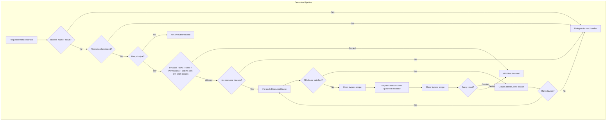
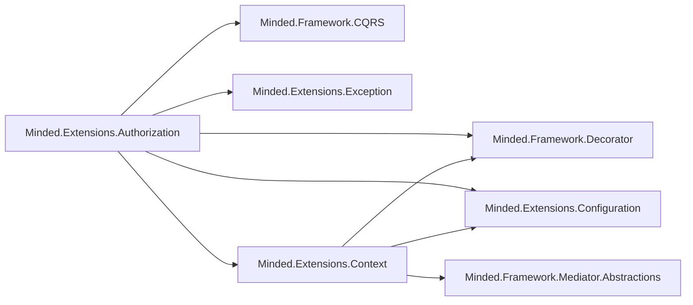

# Design Document: Resource Authorization Policies

## Overview

This design extends the Minded authorization system to support claim-based predicates and resource-instance ownership checks. The current system evaluates only roles and permissions synchronously via `RequireRolesAttribute` and `RequirePermissionsAttribute`. This feature introduces three new capabilities:

1. **Claims on AuthorizationContext** — generic `IReadOnlyDictionary<string, string>` for arbitrary identity data (tenant, region, clearance level, user ID).
2. **RequireClaimAttribute** — synchronous claim-based authorization using the same `AuthorizationMatch` semantics as roles/permissions.
3. **ResourceAuthorizeAttribute** — asynchronous resource-instance authorization that dispatches a mediator query to verify access, with OR-clause short-circuiting and recursion prevention via `IMindedContext` scoped values.

The design preserves full backward compatibility. Existing RBAC-only consumers see no behavioral change. Resource authorization is opt-in and requires the consumer to also register `Minded.Extensions.Context`.

### Design Decisions

**D1: Add a project reference from Authorization to Context.**
The authorization project currently does not reference `Minded.Extensions.Context`. Resource authorization requires `IMindedContextAccessor` for recursion prevention. Rather than making this optional at the project-reference level (which would require conditional compilation or reflection), the design adds a direct `ProjectReference` to `Minded.Extensions.Context`. This is acceptable because:
- Context is a lightweight package with no heavy dependencies.
- The `IMindedContextAccessor` dependency in the decorators is injected via DI — if the consumer doesn't register Context decorators, the accessor returns `NullMindedContext` which makes `TryGetScoped` always return false, so RBAC-only consumers are unaffected.
- It keeps the code simple and type-safe.

**D2: Keep the existing synchronous evaluator for RBAC + claims; add async resource evaluation in the decorator.**
The `IRequestAuthorizationEvaluator` remains synchronous and gains claim clause evaluation. Resource authorization (which requires async mediator dispatch) is handled directly in the decorator, not in the evaluator. This avoids forcing the evaluator interface to become async, which would be a breaking change for consumers who have custom evaluator implementations.

**D3: OR clauses are modeled as three separate `string[]` properties on all authorization attributes.**
All authorization attributes (`ResourceAuthorizeAttribute`, `RequireRolesAttribute`, `RequirePermissionsAttribute`, `RequireClaimAttribute`) carry optional `OrAnyRole`, `OrAnyPermission`, and `OrAnyClaim` arrays. The `OrAny` prefix makes the semantics self-documenting: "if the caller has any of these, skip the primary check." Each array is self-describing (no prefix convention needed), supports multiple values per type, and can be combined freely. If any single condition across all three arrays is satisfied, the primary check for that attribute is skipped.

**D4: Authorization query instantiation via two-parameter constructor convention.**
The `queryType` specified on `ResourceAuthorizeAttribute` must have a public constructor accepting `(object resourceId, string claimValue)`. The decorator uses `Activator.CreateInstance` with these two arguments. This is validated at startup.

## Architecture



### Project Dependency Graph (after change)



## Components and Interfaces

### 1. AuthorizationContext (modified)

**File:** `Extensions/Minded.Extensions.Authorization/AuthorizationContext.cs`

Add a `Claims` property and extend the constructor:

```csharp
public class AuthorizationContext
{
    public bool HasPrincipal { get; }
    public IReadOnlyCollection<string> Roles { get; }
    public IReadOnlyCollection<string> Permissions { get; }
    public IReadOnlyDictionary<string, string> Claims { get; }

    // New constructor with claims (backward-compatible via optional parameter)
    public AuthorizationContext(
        bool hasPrincipal,
        IReadOnlyCollection<string> roles = null,
        IReadOnlyCollection<string> permissions = null,
        IReadOnlyDictionary<string, string> claims = null)
    {
        HasPrincipal = hasPrincipal;
        Roles = roles ?? Array.Empty<string>();
        Permissions = permissions ?? Array.Empty<string>();
        Claims = claims ?? new Dictionary<string, string>(StringComparer.OrdinalIgnoreCase);
    }
}
```

The `Claims` dictionary uses `StringComparer.OrdinalIgnoreCase` for case-insensitive key lookup, consistent with the existing case-insensitive matching for roles and permissions.

### 2. RequireClaimAttribute (new)

**File:** `Extensions/Minded.Extensions.Authorization/Attributes/RequireClaimAttribute.cs`

Follows the same pattern as `RequireRolesAttribute` and `RequirePermissionsAttribute`:

```csharp
[AttributeUsage(AttributeTargets.Class, AllowMultiple = true, Inherited = true)]
public class RequireClaimAttribute : Attribute
{
    public string ClaimType { get; }
    public string[] Values { get; }
    public new AuthorizationMatch Match { get; set; } = AuthorizationMatch.All;
    public int Minimum { get; set; } = 0;

    // Optional: compare claim value against a property on the request object
    public string MatchProperty { get; set; }

    // OR short-circuit conditions
    public string[] OrAnyRole { get; set; }
    public string[] OrAnyPermission { get; set; }
    public string[] OrAnyClaim { get; set; }

    public RequireClaimAttribute(string claimType, params string[] values)
    {
        ClaimType = claimType;
        Values = values;
    }
}
```

**Usage examples:**

```csharp
// Static value check: claim "region" must be "EU" or "US"
[RequireClaim("region", "EU", "US", Match = AuthorizationMatch.Any)]
public sealed record GetRegionalDataQuery(string Region) : IQuery<RegionalData>;

// Dynamic property match: claim "OrganizationId" must equal request.OrgId
[RequireClaim("OrganizationId", MatchProperty = nameof(OrgId))]
public sealed record GetOrgDataQuery(Guid OrgId) : IQuery<OrgData>;

// Dynamic property match with OR short-circuit: skip if caller is GlobalAdmin
[RequireClaim("OrganizationId", MatchProperty = nameof(OrgId),
    OrAnyRole = new[] { "GlobalAdmin" })]
public sealed record UpdateOrgSettingsCommand(Guid OrgId, string Settings) : ICommand;
```

When `MatchProperty` is set, the decorator reads `request.OrgId.ToString()` and compares it case-insensitively against `context.Claims["OrganizationId"]`. The `values` parameter is ignored in this mode. This check happens in the decorator (not the evaluator) because it needs access to the request object.

### 2b. RequireRolesAttribute (modified)

**File:** `Extensions/Minded.Extensions.Authorization/Attributes/RequireRolesAttribute.cs`

Add OR clause properties to the existing attribute:

```csharp
[AttributeUsage(AttributeTargets.Class, AllowMultiple = true, Inherited = true)]
public class RequireRolesAttribute : Attribute
{
    public string[] Roles { get; }
    public new AuthorizationMatch Match { get; set; } = AuthorizationMatch.All;
    public int Minimum { get; set; } = 0;

    // OR short-circuit conditions
    public string[] OrAnyRole { get; set; }
    public string[] OrAnyPermission { get; set; }
    public string[] OrAnyClaim { get; set; }

    public RequireRolesAttribute(params string[] roles)
    {
        Roles = roles;
    }
}
```

**Usage examples:**

```csharp
// Require Editor role, OR skip if caller has Admin role or ManageAll permission
[RequireRoles("Editor",
    OrAnyRole = new[] { "Admin" },
    OrAnyPermission = new[] { "ManageAll" })]
public sealed record UpdateDocumentCommand(Guid DocId, string Content) : ICommand;
```

### 2c. RequirePermissionsAttribute (modified)

**File:** `Extensions/Minded.Extensions.Authorization/Attributes/RequirePermissionsAttribute.cs`

Add OR clause properties to the existing attribute:

```csharp
[AttributeUsage(AttributeTargets.Class, AllowMultiple = true, Inherited = true)]
public class RequirePermissionsAttribute : Attribute
{
    public string[] Permissions { get; }
    public new AuthorizationMatch Match { get; set; } = AuthorizationMatch.All;
    public int Minimum { get; set; } = 0;

    // OR short-circuit conditions
    public string[] OrAnyRole { get; set; }
    public string[] OrAnyPermission { get; set; }
    public string[] OrAnyClaim { get; set; }

    public RequirePermissionsAttribute(params string[] permissions)
    {
        Permissions = permissions;
    }
}
```

### 3. ResourceAuthorizeAttribute (new)

**File:** `Extensions/Minded.Extensions.Authorization/Attributes/ResourceAuthorizeAttribute.cs`

```csharp
[AttributeUsage(AttributeTargets.Class, AllowMultiple = true, Inherited = true)]
public class ResourceAuthorizeAttribute : Attribute
{
    public string ResourceIdProperty { get; }
    public string ClaimName { get; }
    public Type QueryType { get; }

    // OR short-circuit conditions — any one match across all arrays skips the query dispatch
    public string[] OrAnyRole { get; set; }
    public string[] OrAnyPermission { get; set; }
    public string[] OrAnyClaim { get; set; }

    public ResourceAuthorizeAttribute(
        string resourceIdProperty,
        string claimName,
        Type queryType)
    {
        ResourceIdProperty = resourceIdProperty;
        ClaimName = claimName;
        QueryType = queryType;
    }
}
```

**Usage examples:**

```csharp
// Simple resource check — no OR clauses
[ResourceAuthorize(
    resourceIdProperty: nameof(ProjectId),
    claimName: "UserId",
    queryType: typeof(CanUserUpdateProjectQuery))]
public sealed record UpdateProjectCommand(Guid ProjectId, string Name) : ICommand;

// Resource check with single OR role
[ResourceAuthorize(
    resourceIdProperty: nameof(ProjectId),
    claimName: "UserId",
    queryType: typeof(CanUserUpdateProjectQuery),
    OrAnyRole = new[] { "Admin" })]
public sealed record UpdateProjectCommand(Guid ProjectId, string Name) : ICommand;

// Resource check with multiple OR conditions across types
[ResourceAuthorize(
    resourceIdProperty: nameof(GroupId),
    claimName: "UserId",
    queryType: typeof(GetUsersInGroupQuery),
    OrAnyRole = new[] { "Admin", "SuperUser" },
    OrAnyPermission = new[] { "CanAccessAllGroups" },
    OrAnyClaim = new[] { "IsGlobalAdmin" })]
public sealed record GetGroupUsersQuery(Guid GroupId) : IQuery<List<User>>;
```

### 4. AuthorizationDescriptor (extended)

**File:** `Extensions/Minded.Extensions.Authorization/AuthorizationDescriptor.cs`

Add `ResourceClauses` and `ClaimClauses`:

```csharp
public sealed class AuthorizationDescriptor
{
    public bool IsProtected { get; }
    public bool AllowUnauthenticated { get; }
    public bool RequireAuthenticationOnly { get; }
    public IReadOnlyList<RoleClause> RoleClauses { get; }
    public IReadOnlyList<PermissionClause> PermissionClauses { get; }
    public IReadOnlyList<ClaimClause> ClaimClauses { get; }
    public IReadOnlyList<ResourceClause> ResourceClauses { get; }

    public AuthorizationDescriptor(
        bool isProtected,
        bool allowUnauthenticated,
        bool requireAuthenticationOnly,
        IReadOnlyList<RoleClause> roleClauses,
        IReadOnlyList<PermissionClause> permissionClauses,
        IReadOnlyList<ClaimClause> claimClauses,
        IReadOnlyList<ResourceClause> resourceClauses)
    { /* assign all */ }
}

// Existing RoleClause — extended with OR arrays
public sealed class RoleClause
{
    public IReadOnlyList<string> Roles { get; }
    public AuthorizationMatch Match { get; }
    public int Minimum { get; }
    public IReadOnlyList<string> OrAnyRole { get; }
    public IReadOnlyList<string> OrAnyPermission { get; }
    public IReadOnlyList<string> OrAnyClaim { get; }

    public RoleClause(IReadOnlyList<string> roles, AuthorizationMatch match, int minimum,
        IReadOnlyList<string> orAnyRole, IReadOnlyList<string> orAnyPermission,
        IReadOnlyList<string> orAnyClaim)
    { /* assign all */ }
}

// Existing PermissionClause — extended with OR arrays
public sealed class PermissionClause
{
    public IReadOnlyList<string> Permissions { get; }
    public AuthorizationMatch Match { get; }
    public int Minimum { get; }
    public IReadOnlyList<string> OrAnyRole { get; }
    public IReadOnlyList<string> OrAnyPermission { get; }
    public IReadOnlyList<string> OrAnyClaim { get; }

    public PermissionClause(IReadOnlyList<string> permissions, AuthorizationMatch match, int minimum,
        IReadOnlyList<string> orAnyRole, IReadOnlyList<string> orAnyPermission,
        IReadOnlyList<string> orAnyClaim)
    { /* assign all */ }
}

public sealed class ClaimClause
{
    public string ClaimType { get; }
    public IReadOnlyList<string> Values { get; }
    public AuthorizationMatch Match { get; }
    public int Minimum { get; }
    public string MatchProperty { get; }  // null = static values check, non-null = dynamic property match
    public IReadOnlyList<string> OrAnyRole { get; }
    public IReadOnlyList<string> OrAnyPermission { get; }
    public IReadOnlyList<string> OrAnyClaim { get; }

    public ClaimClause(string claimType, IReadOnlyList<string> values,
        AuthorizationMatch match, int minimum, string matchProperty,
        IReadOnlyList<string> orAnyRole, IReadOnlyList<string> orAnyPermission,
        IReadOnlyList<string> orAnyClaim)
    { /* assign all */ }
}

public sealed class ResourceClause
{
    public string ResourceIdProperty { get; }
    public string ClaimName { get; }
    public Type QueryType { get; }
    public IReadOnlyList<string> OrAnyRole { get; }
    public IReadOnlyList<string> OrAnyPermission { get; }
    public IReadOnlyList<string> OrAnyClaim { get; }

    public ResourceClause(string resourceIdProperty, string claimName,
        Type queryType, IReadOnlyList<string> orAnyRole,
        IReadOnlyList<string> orAnyPermission, IReadOnlyList<string> orAnyClaim)
    { /* assign all */ }
}
```

### 5. AuthorizationDescriptorCache (extended)

**File:** `Extensions/Minded.Extensions.Authorization/Decorator/AuthorizationDescriptorCache.cs`

The `Compile` method is extended to handle `RequireClaimAttribute` and `ResourceAuthorizeAttribute`:

```csharp
private static AuthorizationDescriptor Compile(Type requestType)
{
    var attributes = Attribute.GetCustomAttributes(requestType, true);

    var roleClauses = new List<RoleClause>();
    var permissionClauses = new List<PermissionClause>();
    var claimClauses = new List<ClaimClause>();
    var resourceClauses = new List<ResourceClause>();
    bool hasRequireAuthentication = false;
    bool hasAllowUnauthenticated = false;

    foreach (var attr in attributes)
    {
        // ... existing role/permission handling ...

        if (attr is RequireClaimAttribute claimAttr)
        {
            claimClauses.Add(new ClaimClause(
                claimAttr.ClaimType,
                Array.AsReadOnly(claimAttr.Values),
                claimAttr.Match,
                claimAttr.Minimum));
        }
        else if (attr is ResourceAuthorizeAttribute resAttr)
        {
            // Validate resourceIdProperty exists on requestType
            var prop = requestType.GetProperty(resAttr.ResourceIdProperty);
            if (prop == null)
                throw new InvalidOperationException(
                    $"Type '{requestType.Name}' has ResourceAuthorizeAttribute " +
                    $"referencing property '{resAttr.ResourceIdProperty}' which does not exist.");

            // Validate queryType implements IQuery<bool> or IQuery<IQueryResponse<bool>>
            ValidateQueryType(requestType, resAttr.QueryType);

            resourceClauses.Add(new ResourceClause(
                resAttr.ResourceIdProperty,
                resAttr.ClaimName,
                resAttr.QueryType,
                Array.AsReadOnly(resAttr.OrAnyRole ?? Array.Empty<string>()),
                Array.AsReadOnly(resAttr.OrAnyPermission ?? Array.Empty<string>()),
                Array.AsReadOnly(resAttr.OrAnyClaim ?? Array.Empty<string>())));
        }
    }

    bool hasRbacClauses = roleClauses.Count > 0
        || permissionClauses.Count > 0
        || claimClauses.Count > 0;
    bool hasResourceClauses = resourceClauses.Count > 0;
    bool isProtected = hasRbacClauses || hasResourceClauses || hasRequireAuthentication;
    bool requireAuthenticationOnly = hasRequireAuthentication
        && !hasRbacClauses && !hasResourceClauses;

    return new AuthorizationDescriptor(
        isProtected, hasAllowUnauthenticated, requireAuthenticationOnly,
        roleClauses.AsReadOnly(), permissionClauses.AsReadOnly(),
        claimClauses.AsReadOnly(), resourceClauses.AsReadOnly());
}

private static void ValidateQueryType(Type requestType, Type queryType)
{
    // Must implement IQuery<bool> or IQuery<IQueryResponse<bool>>
    var interfaces = queryType.GetInterfaces();
    bool implementsQueryBool = interfaces.Any(i =>
        i.IsGenericType && i.GetGenericTypeDefinition() == typeof(IQuery<>)
        && (i.GetGenericArguments()[0] == typeof(bool)
            || (i.GetGenericArguments()[0].IsGenericType
                && i.GetGenericArguments()[0].GetGenericTypeDefinition() == typeof(IQueryResponse<>)
                && i.GetGenericArguments()[0].GetGenericArguments()[0] == typeof(bool))));

    if (!implementsQueryBool)
        throw new InvalidOperationException(
            $"Type '{requestType.Name}' has ResourceAuthorizeAttribute with queryType " +
            $"'{queryType.Name}' which does not implement IQuery<bool> or " +
            $"IQuery<IQueryResponse<bool>>.");

    // Must have a constructor accepting (object, string)
    var ctor = queryType.GetConstructor(new[] { typeof(object), typeof(string) });
    if (ctor == null)
        throw new InvalidOperationException(
            $"Type '{requestType.Name}' has ResourceAuthorizeAttribute with queryType " +
            $"'{queryType.Name}' which does not have a constructor accepting " +
            $"(object resourceId, string claimValue).");
}
```

### 6. AttributeValidator (extended)

**File:** `Extensions/Minded.Extensions.Authorization/Decorator/AttributeValidator.cs`

Add validation for `RequireClaimAttribute` and `ResourceAuthorizeAttribute`:

```csharp
internal static void Validate(Type requestType)
{
    var attributes = Attribute.GetCustomAttributes(requestType, true);

    bool hasRbac = false;
    bool hasAllowUnauthenticated = false;
    bool hasRequireAuthentication = false;
    bool hasResourceAuthorize = false;

    foreach (var attr in attributes)
    {
        // ... existing role/permission validation ...

        if (attr is RequireClaimAttribute claimAttr)
        {
            hasRbac = true;
            ValidateClaimItems(requestType, claimAttr);
        }
        else if (attr is ResourceAuthorizeAttribute resAttr)
        {
            hasResourceAuthorize = true;
            ValidateResourceAuthorize(requestType, resAttr);
        }
    }

    if (hasAllowUnauthenticated && (hasRbac || hasRequireAuthentication || hasResourceAuthorize))
    {
        throw new InvalidOperationException(
            $"Type '{requestType.Name}' has AllowUnauthenticatedAttribute combined with " +
            "RBAC, RequireAuthenticationAttribute, or ResourceAuthorizeAttribute. " +
            "These are contradictory and cannot be used together.");
    }
}

private static void ValidateClaimItems(Type requestType, RequireClaimAttribute attr)
{
    if (string.IsNullOrWhiteSpace(attr.ClaimType))
        throw new InvalidOperationException(
            $"Type '{requestType.Name}' has RequireClaimAttribute with blank claimType.");

    ValidateItems(requestType, attr.Values, attr.Match, attr.Minimum, "RequireClaimAttribute");
}

private static void ValidateResourceAuthorize(Type requestType, ResourceAuthorizeAttribute attr)
{
    if (string.IsNullOrWhiteSpace(attr.ResourceIdProperty))
        throw new InvalidOperationException(
            $"Type '{requestType.Name}' has ResourceAuthorizeAttribute with blank resourceIdProperty.");

    if (string.IsNullOrWhiteSpace(attr.ClaimName))
        throw new InvalidOperationException(
            $"Type '{requestType.Name}' has ResourceAuthorizeAttribute with blank claimName.");

    if (attr.QueryType == null)
        throw new InvalidOperationException(
            $"Type '{requestType.Name}' has ResourceAuthorizeAttribute with null queryType.");

    // Validate OR arrays contain no blank/whitespace entries
    ValidateOrArray(requestType, attr.OrAnyRole, "OrAnyRole");
    ValidateOrArray(requestType, attr.OrAnyPermission, "OrAnyPermission");
    ValidateOrArray(requestType, attr.OrAnyClaim, "OrAnyClaim");
}

private static void ValidateOrArray(Type requestType, string[] values, string arrayName)
{
    if (values == null) return;
    foreach (var value in values)
    {
        if (string.IsNullOrWhiteSpace(value))
            throw new InvalidOperationException(
                $"Type '{requestType.Name}' has ResourceAuthorizeAttribute with blank entry in {arrayName}.");
    }
}
```

### 7. DefaultRequestAuthorizationEvaluator (extended)

**File:** `Extensions/Minded.Extensions.Authorization/DefaultRequestAuthorizationEvaluator.cs`

Add claim clause evaluation and OR clause support for all attribute types after role and permission clauses:

```csharp
public AuthorizationDecision Evaluate(Type requestType, AuthorizationDescriptor descriptor, AuthorizationContext context)
{
    // ... existing principal check ...
    // ... existing requireAuthenticationOnly check (updated to include ClaimClauses.Count == 0) ...

    // Evaluate role clauses (with OR short-circuit)
    foreach (var clause in descriptor.RoleClauses)
    {
        if (!IsOrClauseSatisfied(clause.OrAnyRole, clause.OrAnyPermission, clause.OrAnyClaim, context))
        {
            if (!EvaluateClause(clause.Roles, context.Roles, clause.Match, clause.Minimum))
                return AuthorizationDecision.Deny();
        }
    }

    // Evaluate permission clauses (with OR short-circuit)
    foreach (var clause in descriptor.PermissionClauses)
    {
        if (!IsOrClauseSatisfied(clause.OrAnyRole, clause.OrAnyPermission, clause.OrAnyClaim, context))
        {
            if (!EvaluateClause(clause.Permissions, context.Permissions, clause.Match, clause.Minimum))
                return AuthorizationDecision.Deny();
        }
    }

    // Evaluate claim clauses (with OR short-circuit) — static values only
    // Claim clauses with MatchProperty are evaluated in the decorator (needs request object)
    foreach (var clause in descriptor.ClaimClauses)
    {
        if (clause.MatchProperty != null)
            continue; // Handled by decorator

        if (!IsOrClauseSatisfied(clause.OrAnyRole, clause.OrAnyPermission, clause.OrAnyClaim, context))
        {
            if (!EvaluateClaimClause(clause, context))
                return AuthorizationDecision.Deny();
        }
    }

    return AuthorizationDecision.Allow();
}

/// <summary>
/// Checks if any OR condition is satisfied across all three OR arrays.
/// Used by role, permission, and claim clause evaluation.
/// </summary>
private static bool IsOrClauseSatisfied(
    IReadOnlyList<string> orAnyRole,
    IReadOnlyList<string> orAnyPermission,
    IReadOnlyList<string> orAnyClaim,
    AuthorizationContext context)
{
    foreach (var role in orAnyRole)
    {
        if (context.Roles.Any(r =>
            string.Equals(r.Trim(), role.Trim(), StringComparison.OrdinalIgnoreCase)))
            return true;
    }

    foreach (var permission in orAnyPermission)
    {
        if (context.Permissions.Any(p =>
            string.Equals(p.Trim(), permission.Trim(), StringComparison.OrdinalIgnoreCase)))
            return true;
    }

    foreach (var claimKey in orAnyClaim)
    {
        if (context.Claims.ContainsKey(claimKey.Trim()))
            return true;
    }

    return false;
}

private static bool EvaluateClaimClause(ClaimClause clause, AuthorizationContext context)
{
    // Look up the claim value from context
    if (!context.Claims.TryGetValue(clause.ClaimType, out var claimValue))
        return false; // Claim not present → deny

    // Treat the single claim value as a one-element collection for matching
    var contextValues = new HashSet<string>(
        new[] { claimValue.Trim() },
        StringComparer.OrdinalIgnoreCase);

    // Evaluate against allowed values using the same match logic
    switch (clause.Match)
    {
        case AuthorizationMatch.All:
            return clause.Values.All(v => contextValues.Contains(v.Trim()));
        case AuthorizationMatch.Any:
            return clause.Values.Any(v => contextValues.Contains(v.Trim()));
        case AuthorizationMatch.AtLeast:
            return clause.Values.Count(v => contextValues.Contains(v.Trim())) >= clause.Minimum;
        case AuthorizationMatch.None:
            return !clause.Values.Any(v => contextValues.Contains(v.Trim()));
        default:
            return false;
    }
}
```

**Note:** Since `Claims` is `IReadOnlyDictionary<string, string>` (single value per key), the `All` match mode with multiple values will only pass if all specified values equal the single claim value (case-insensitive). In practice, `Any` is the most common match mode for claims with multiple allowed values (e.g., region claim must be one of "EU", "US", "APAC").

### 8. Authorization Decorators (modified)

**File:** `Extensions/Minded.Extensions.Authorization/Decorator/AuthorizationCommandHandlerDecorator.cs`
**File:** `Extensions/Minded.Extensions.Authorization/Decorator/AuthorizationQueryHandlerDecorator.cs`

Both decorators gain:
1. A new `IMindedContextAccessor` constructor dependency.
2. A private `AuthorizationBypass` marker struct.
3. Bypass check at the top of `HandleAsync`.
4. Resource clause evaluation after RBAC passes.

Pseudocode for the command decorator with result (`AuthorizationCommandHandlerDecorator<TCommand, TResult>`):

```csharp
public class AuthorizationCommandHandlerDecorator<TCommand, TResult>
    : CommandHandlerDecoratorBase<TCommand, TResult>, ICommandHandler<TCommand, TResult>
    where TCommand : ICommand<TResult>
{
    private readonly ICommandHandler<TCommand, TResult> _next;
    private readonly IAuthorizationContextAccessor _contextAccessor;
    private readonly IRequestAuthorizationEvaluator _evaluator;
    private readonly IOptions<AuthorizationOptions> _options;
    private readonly IMindedContextAccessor _mindedContextAccessor;
    private readonly ILogger _logger;

    private readonly struct AuthorizationBypass { }

    public AuthorizationCommandHandlerDecorator(
        ICommandHandler<TCommand, TResult> commandHandler,
        IAuthorizationContextAccessor contextAccessor,
        IRequestAuthorizationEvaluator evaluator,
        IOptions<AuthorizationOptions> options,
        IMindedContextAccessor mindedContextAccessor,
        ILogger<AuthorizationCommandHandlerDecorator<TCommand, TResult>> logger)
        : base(commandHandler)
    {
        _contextAccessor = contextAccessor;
        _evaluator = evaluator;
        _options = options;
        _mindedContextAccessor = mindedContextAccessor;
        _logger = logger;
    }

    public async Task<ICommandResponse<TResult>> HandleAsync(
        TCommand command, CancellationToken cancellationToken = default)
    {
        // Step 1: Recursion bypass check
        var mindedContext = _mindedContextAccessor.Current;
        if (mindedContext.TryGetScoped<AuthorizationBypass>(out _))
            return await DecoratedCommmandHandler.HandleAsync(command, cancellationToken);

        var stopwatch = Stopwatch.StartNew();

        try
        {
            var descriptor = AuthorizationDescriptorCache.GetOrCreate(typeof(TCommand));

            // Step 2: AllowUnauthenticated pass-through
            if (descriptor.AllowUnauthenticated)
                return await DecoratedCommmandHandler.HandleAsync(command, cancellationToken);

            // Step 3: Determine if auth is needed
            bool enforceAuth = _options.Value.GetEffectiveRequireAuthenticationForAllCommands();
            bool needsAuth = descriptor.IsProtected || (enforceAuth && !descriptor.AllowUnauthenticated);
            if (!needsAuth)
                return await DecoratedCommmandHandler.HandleAsync(command, cancellationToken);

            // Step 4: Check principal
            var authContext = _contextAccessor.Current;
            if (authContext?.HasPrincipal != true)
            {
                LogDenied(command, stopwatch.Elapsed, isUnauthenticated: true);
                return CommandResponse<TResult>.Error(CreateUnauthenticatedOutcomeEntry());
            }

            // Step 5: Evaluate RBAC (roles + permissions + claims) synchronously
            if (descriptor.RoleClauses.Count > 0
                || descriptor.PermissionClauses.Count > 0
                || descriptor.ClaimClauses.Count > 0)
            {
                var decision = _evaluator.Evaluate(typeof(TCommand), descriptor, authContext);
                if (!decision.Allowed)
                {
                    LogDenied(command, stopwatch.Elapsed, isUnauthenticated: false);
                    return CommandResponse<TResult>.Error(CreateUnauthorizedOutcomeEntry());
                }
            }

            // Step 6: Evaluate MatchProperty claim clauses (needs request object)
            foreach (var clause in descriptor.ClaimClauses)
            {
                if (clause.MatchProperty == null)
                    continue; // Already handled by evaluator in Step 5

                // Check OR clause first
                if (IsOrClauseSatisfied(clause.OrAnyRole, clause.OrAnyPermission, clause.OrAnyClaim, authContext))
                    continue;

                // Read claim value from context
                if (!authContext.Claims.TryGetValue(clause.ClaimType, out var claimValue))
                {
                    LogDenied(command, stopwatch.Elapsed, isUnauthenticated: false);
                    return CommandResponse<TResult>.Error(CreateUnauthorizedOutcomeEntry());
                }

                // Read property value from request
                var propertyValue = typeof(TCommand).GetProperty(clause.MatchProperty)
                    .GetValue(command)?.ToString();

                // Compare case-insensitively
                if (!string.Equals(claimValue?.Trim(), propertyValue?.Trim(),
                    StringComparison.OrdinalIgnoreCase))
                {
                    LogDenied(command, stopwatch.Elapsed, isUnauthenticated: false);
                    return CommandResponse<TResult>.Error(CreateUnauthorizedOutcomeEntry());
                }
            }

            // Step 7: Evaluate resource clauses (async)
            foreach (var clause in descriptor.ResourceClauses)
            {
                // 7a: Check OR clause first
                if (IsOrClauseSatisfied(clause, authContext))
                    continue; // This clause passes via OR short-circuit

                // 7b: Read resource ID from request
                var resourceId = GetResourceId(command, clause.ResourceIdProperty);

                // 7c: Read claim value from context
                if (!authContext.Claims.TryGetValue(clause.ClaimName, out var claimValue))
                {
                    LogDenied(command, stopwatch.Elapsed, isUnauthenticated: false);
                    return CommandResponse<TResult>.Error(CreateUnauthorizedOutcomeEntry());
                }

                // 7d: Dispatch authorization query with bypass scope
                bool granted;
                using (mindedContext.BeginScope(new AuthorizationBypass()))
                {
                    var query = (IQuery<bool>)Activator.CreateInstance(
                        clause.QueryType, resourceId, claimValue);
                    granted = await mindedContext.Mediator
                        .ProcessQueryAsync(query, cancellationToken);
                }
                // Scope closed before continuing

                if (!granted)
                {
                    LogDenied(command, stopwatch.Elapsed, isUnauthenticated: false);
                    return CommandResponse<TResult>.Error(CreateUnauthorizedOutcomeEntry());
                }
            }

            // Step 8: All checks passed
            LogAllowed(command, stopwatch.Elapsed);
            return await DecoratedCommmandHandler.HandleAsync(command, cancellationToken);
        }
        catch (Exception)
        {
            LogDenied(command, stopwatch.Elapsed, isUnauthenticated: false);
            return CommandResponse<TResult>.Error(CreateUnauthorizedOutcomeEntry());
        }
    }

    private static bool IsOrClauseSatisfied(ResourceClause clause, AuthorizationContext context)
    {
        // Check OrAnyRole — any match short-circuits
        foreach (var role in clause.OrAnyRole)
        {
            if (context.Roles.Any(r =>
                string.Equals(r.Trim(), role.Trim(), StringComparison.OrdinalIgnoreCase)))
                return true;
        }

        // Check OrAnyPermission — any match short-circuits
        foreach (var permission in clause.OrAnyPermission)
        {
            if (context.Permissions.Any(p =>
                string.Equals(p.Trim(), permission.Trim(), StringComparison.OrdinalIgnoreCase)))
                return true;
        }

        // Check OrAnyClaim — any matching claim key short-circuits
        foreach (var claimKey in clause.OrAnyClaim)
        {
            if (context.Claims.ContainsKey(claimKey.Trim()))
                return true;
        }

        return false;
    }

    private static object GetResourceId(TCommand command, string propertyName)
    {
        // PropertyInfo is cached by the CLR's reflection cache
        var prop = typeof(TCommand).GetProperty(propertyName);
        return prop.GetValue(command);
    }
}
```

The same pattern applies to all four decorator variants:
- `AuthorizationCommandHandlerDecorator<TCommand>` (ICommand without result)
- `AuthorizationCommandHandlerDecorator<TCommand, TResult>` (ICommand with result)
- `AuthorizationQueryHandlerDecorator<TQuery, TResult>` (IQuery)

The query decorator must also handle the `IQuery<IQueryResponse<bool>>` return type for authorization queries. When the authorization query returns `IQueryResponse<bool>`, the decorator checks `response.Successful && response.Result` to determine access.

### 9. ServiceCollectionExtensions (extended)

**File:** `Extensions/Minded.Extensions.Authorization/Configuration/ServiceCollectionExtensions.cs`

The registration methods are updated to:
1. Register `IMindedContextAccessor` as a dependency (resolved from DI — if Context decorators are registered, it's the real accessor; otherwise `NullMindedContext` is used).
2. Include `RequireClaimAttribute` and `ResourceAuthorizeAttribute` in eager validation.

```csharp
public static MindedBuilder AddCommandAuthorizationDecorator(
    this MindedBuilder builder, Action<AuthorizationOptions> configure = null)
{
    // ... existing options and evaluator registration ...

    // Ensure IMindedContextAccessor is available (no-op if already registered by Context extension)
    builder.ServiceCollection.TryAddSingleton<IMindedContextAccessor, NullMindedContextAccessor>();

    // ... existing decorator queuing ...

    // Eagerly validate all attributes including new ones
    EagerlyValidateAttributes(builder, typeof(ICommandHandler<>));
    EagerlyValidateAttributes(builder, typeof(ICommandHandler<,>));

    return builder;
}
```

A `NullMindedContextAccessor` fallback is registered so that the decorator can always resolve `IMindedContextAccessor`. When the Context extension is not registered, `TryGetScoped` returns false and `Mediator` is null — but resource clauses won't be present on any request type in that scenario, so the mediator is never accessed.

### 10. Project Reference Change

**File:** `Extensions/Minded.Extensions.Authorization/Minded.Extensions.Authorization.csproj`

Add:
```xml
<ProjectReference Include="..\Minded.Extensions.Context\Minded.Extensions.Context.csproj" />
```

## Data Models

### New Types

| Type | Kind | Location |
|------|------|----------|
| `RequireClaimAttribute` | Attribute | `Attributes/RequireClaimAttribute.cs` |
| `ResourceAuthorizeAttribute` | Attribute | `Attributes/ResourceAuthorizeAttribute.cs` |
| `ClaimClause` | Immutable class | `AuthorizationDescriptor.cs` |
| `ResourceClause` | Immutable class | `AuthorizationDescriptor.cs` |

### Modified Types

| Type | Change |
|------|--------|
| `AuthorizationContext` | Add `Claims` property, extend constructor |
| `AuthorizationDescriptor` | Add `ClaimClauses`, `ResourceClauses` properties, extend constructor |
| `RoleClause` | Add `OrAnyRole`, `OrAnyPermission`, `OrAnyClaim` properties |
| `PermissionClause` | Add `OrAnyRole`, `OrAnyPermission`, `OrAnyClaim` properties |
| `RequireRolesAttribute` | Add `OrAnyRole`, `OrAnyPermission`, `OrAnyClaim` properties |
| `RequirePermissionsAttribute` | Add `OrAnyRole`, `OrAnyPermission`, `OrAnyClaim` properties |
| `AuthorizationDescriptorCache` | Compile new attribute types, compile OR arrays on all attributes |
| `AttributeValidator` | Validate new attribute types, validate OR arrays on all attributes |
| `DefaultRequestAuthorizationEvaluator` | Evaluate claim clauses, evaluate OR short-circuits on all clause types |
| `AuthorizationCommandHandlerDecorator<TCommand>` | Add bypass check, resource clause evaluation |
| `AuthorizationCommandHandlerDecorator<TCommand, TResult>` | Add bypass check, resource clause evaluation |
| `AuthorizationQueryHandlerDecorator<TQuery, TResult>` | Add bypass check, resource clause evaluation |
| `ServiceCollectionExtensions` | Register IMindedContextAccessor fallback, validate new attributes |


## Correctness Properties

*A property is a characteristic or behavior that should hold true across all valid executions of a system — essentially, a formal statement about what the system should do. Properties serve as the bridge between human-readable specifications and machine-verifiable correctness guarantees.*

### Property 1: Claims construction round-trip

*For any* dictionary of string key-value pairs passed to the `AuthorizationContext` constructor, the `Claims` property SHALL return a dictionary containing exactly the same key-value pairs, retrievable by their original keys.

**Validates: Requirements 1.3**

### Property 2: Case-insensitive claim key lookup

*For any* claim key stored in the `AuthorizationContext.Claims` dictionary, looking up that key using any case variation (upper, lower, mixed) SHALL return the same value.

**Validates: Requirements 1.5**

### Property 3: OR clause satisfaction skips query dispatch

*For any* request decorated with a `ResourceAuthorizeAttribute` that has OR clauses (`OrAnyRole`, `OrAnyPermission`, or `OrAnyClaim`), and *for any* `AuthorizationContext` that satisfies any single OR condition (possesses any specified role, permission, or claim key), the authorization decorator SHALL NOT dispatch the authorization query through the mediator for that clause.

**Validates: Requirements 2.8, 2.9, 2.10, 2.11, 4.2, 4.3, 4.4, 4.5**

### Property 4: Authorization query receives correct resource ID and claim value

*For any* request object carrying a `ResourceAuthorizeAttribute`, the authorization decorator SHALL instantiate the authorization query with the resource identifier value read from the property named by `resourceIdProperty` and the claim value read from the `AuthorizationContext.Claims` dictionary using the key specified by `claimName`.

**Validates: Requirements 3.1, 3.2, 9.3**

### Property 5: Decorator decision matches authorization query result

*For any* request where the authorization query is dispatched, the decorator SHALL allow the request to proceed if and only if the query returns true (or `IQueryResponse<bool>` with `Successful && Result == true`), and SHALL deny with 403 otherwise.

**Validates: Requirements 3.4, 3.5**

### Property 6: AND semantics across all attribute types

*For any* request decorated with multiple authorization attributes (any combination of `RequireRolesAttribute`, `RequirePermissionsAttribute`, `RequireClaimAttribute`, `ResourceAuthorizeAttribute`), the decorator SHALL allow the request only when ALL attributes pass. If any single attribute fails, the request SHALL be denied.

**Validates: Requirements 4.1, 4.7**

### Property 7: OR clause not satisfied triggers query dispatch

*For any* request decorated with a `ResourceAuthorizeAttribute` that has OR clauses, and *for any* `AuthorizationContext` that does NOT satisfy any OR condition, the authorization decorator SHALL dispatch the authorization query through the mediator and use its result to determine whether the clause passes.

**Validates: Requirements 4.6**

### Property 8: Bypass marker skips all authorization

*For any* request entering the authorization decorator when a `AuthorizationBypass` scope is active in `IMindedContext`, the decorator SHALL skip all authorization logic (RBAC, claims, resource checks) and delegate directly to the next handler.

**Validates: Requirements 5.3**

### Property 9: Descriptor compilation preserves all attribute metadata

*For any* request type decorated with `RequireClaimAttribute` and/or `ResourceAuthorizeAttribute` instances, the compiled `AuthorizationDescriptor` SHALL contain clauses that preserve all original attribute data: claim type, allowed values, match mode, minimum (for claim clauses); resource ID property, resource ID claim, query type, OR roles, OR permissions, OR claims (for resource clauses).

**Validates: Requirements 6.3, 10.9**

### Property 10: Claim clause evaluation with match modes

*For any* `RequireClaimAttribute` with a given claim type, allowed values, and `AuthorizationMatch` mode, and *for any* `AuthorizationContext` with claims, the evaluator SHALL correctly determine pass/fail using case-insensitive, trimmed string comparison: `All` requires the claim value to match every allowed value, `Any` requires the claim value to match at least one, `AtLeast` requires at least `Minimum` matches, and `None` requires the claim value to match none of the specified values.

**Validates: Requirements 10.5, 10.7**

### Property 11: OR clause satisfaction on RBAC attributes skips primary check

*For any* `RequireRolesAttribute`, `RequirePermissionsAttribute`, or `RequireClaimAttribute` that has OR clauses (`OrAnyRole`, `OrAnyPermission`, or `OrAnyClaim`), and *for any* `AuthorizationContext` that satisfies any single OR condition, the evaluator SHALL skip the primary clause check for that attribute and treat the attribute as passed.

**Validates: Requirements 11.1-11.5, 12.1-12.5, 13.1-13.5**

### Property 12: MatchProperty claim comparison uses request property value

*For any* `RequireClaimAttribute` with `MatchProperty` set, and *for any* request object and `AuthorizationContext`, the decorator SHALL allow the request only when the claim value from `context.Claims[claimType]` equals `request.{MatchProperty}.ToString()` using case-insensitive, trimmed comparison. If the claim key is missing or the values don't match, the request SHALL be denied with 403.

**Validates: Requirements 10.14, 10.16**

## Error Handling

### Startup Errors (fail-fast)

All attribute configuration errors are detected eagerly during service registration via `AttributeValidator.Validate` and `AuthorizationDescriptorCache.Compile`. These throw `InvalidOperationException` with descriptive messages:

| Error Condition | Message Pattern |
|----------------|-----------------|
| `ResourceAuthorizeAttribute.ResourceIdProperty` doesn't exist on request type | `"Type '{type}' has ResourceAuthorizeAttribute referencing property '{prop}' which does not exist."` |
| `ResourceAuthorizeAttribute.QueryType` doesn't implement `IQuery<bool>` or `IQuery<IQueryResponse<bool>>` | `"Type '{type}' has ResourceAuthorizeAttribute with queryType '{queryType}' which does not implement IQuery<bool> or IQuery<IQueryResponse<bool>>."` |
| `ResourceAuthorizeAttribute.QueryType` lacks required constructor | `"Type '{type}' has ResourceAuthorizeAttribute with queryType '{queryType}' which does not have a constructor accepting (object resourceId, string claimValue)."` |
| `ResourceAuthorizeAttribute` combined with `AllowUnauthenticatedAttribute` | `"Type '{type}' has AllowUnauthenticatedAttribute combined with ... These are contradictory."` |
| `RequireClaimAttribute` with empty/blank values | Same pattern as existing `RequireRolesAttribute` validation |
| `RequireClaimAttribute` with duplicate values | Same pattern as existing validation |
| `RequireClaimAttribute` with invalid `Minimum` for `AtLeast` | Same pattern as existing validation |
| `RequireClaimAttribute` with `MatchProperty` referencing non-existent property | `"Type '{type}' has RequireClaimAttribute with MatchProperty '{prop}' which does not exist."` |
| `RequireClaimAttribute` with neither `values` nor `MatchProperty` | `"Type '{type}' has RequireClaimAttribute with neither values nor MatchProperty specified."` |
| `ResourceAuthorizeAttribute` with blank entry in `OrAnyRole`, `OrAnyPermission`, or `OrAnyClaim` | `"Type '{type}' has ResourceAuthorizeAttribute with blank entry in {arrayName}."` |

### Runtime Errors (deny-by-default)

| Scenario | Behavior |
|----------|----------|
| Missing claim key for `claimName` | 403 Forbidden (claim not present → deny) |
| MatchProperty claim value doesn't match request property value | 403 Forbidden |
| Missing claim key for `RequireClaimAttribute.MatchProperty` | 403 Forbidden (claim not present → deny) |
| Authorization query throws exception | 403 Forbidden (deny-by-default, consistent with existing pattern) |
| `IAuthorizationContextAccessor.Current` returns null | 401 Unauthenticated |
| Any unexpected exception in auth flow | 403 Forbidden (deny-by-default) |
| `Activator.CreateInstance` fails for query type | 403 Forbidden (caught by deny-by-default) |

### Logging

All authorization decisions are logged at the existing log levels:
- `Information` for allowed requests (with duration).
- `Warning` for denied requests (with reason: unauthenticated vs unauthorized).
- Resource clause evaluation adds log entries for OR short-circuits and query dispatch results.

## Testing Strategy

### Test Framework

- **MSTest** as the test runner (existing project convention)
- **FluentAssertions** for assertion readability
- **FsCheck** for property-based testing (already referenced in test project)
- **Moq** for mocking interfaces (`IMediator`, `IMindedContextAccessor`, `IAuthorizationContextAccessor`)

### Dual Testing Approach

**Property-based tests** verify universal properties across generated inputs (minimum 100 iterations per property). Each property test references its design document property with the tag format:

```
Feature: resource-authorization-policies, Property {number}: {property_text}
```

**Unit tests** cover specific examples, edge cases, integration points, and error conditions that are not suitable for property-based testing.

### Test Organization

New test files follow the existing directory structure:

| Directory | New Test Files |
|-----------|---------------|
| `Context/` | `AuthorizationContextClaimsTests.cs` — claims construction, case-insensitivity |
| `Descriptors/` | `ClaimClauseDescriptorTests.cs` — claim clause compilation |
| `Descriptors/` | `ResourceClauseDescriptorTests.cs` — resource clause compilation |
| `Descriptors/` | `AttributeValidationResourceTests.cs` — startup validation for new attributes |
| `Evaluation/` | `ClaimClauseEvaluationTests.cs` — claim evaluation with all match modes |
| `Decorators/` | `ResourceAuthorizationCommandDecoratorTests.cs` — resource auth flow, OR clauses, bypass |
| `Decorators/` | `ResourceAuthorizationQueryDecoratorTests.cs` — resource auth flow for queries |
| `Decorators/` | `RecursionPreventionTests.cs` — bypass marker behavior |
| `Configuration/` | `ServiceCollectionResourceAuthTests.cs` — registration and eager validation |

### Property-Based Test Coverage

| Property | Test Class | What Varies |
|----------|-----------|-------------|
| P1: Claims round-trip | `AuthorizationContextClaimsTests` | Random dictionaries of string key-value pairs |
| P2: Case-insensitive lookup | `AuthorizationContextClaimsTests` | Random keys with case variations |
| P3: OR clause skips query | `ResourceAuthorizationCommandDecoratorTests` | Random contexts with/without OR role/permission/claim |
| P4: Query receives correct values | `ResourceAuthorizationCommandDecoratorTests` | Random resource IDs and claim values |
| P5: Decision matches query result | `ResourceAuthorizationCommandDecoratorTests` | Random requests with query returning true/false |
| P6: AND semantics | `ResourceAuthorizationCommandDecoratorTests` | Random combinations of passing/failing attributes |
| P7: OR not satisfied → dispatch | `ResourceAuthorizationCommandDecoratorTests` | Random contexts without OR condition |
| P8: Bypass marker skips auth | `RecursionPreventionTests` | Random requests with bypass active |
| P9: Descriptor compilation | `ResourceClauseDescriptorTests` | Random attribute configurations |
| P10: Claim evaluation | `ClaimClauseEvaluationTests` | Random claim types, values, match modes |

### Unit Test Coverage (examples and edge cases)

- Backward compatibility: existing constructor without claims parameter still works
- `AllowMultiple` attribute metadata verification
- Missing `resourceIdProperty` → `InvalidOperationException` at startup
- Invalid `queryType` → `InvalidOperationException` at startup
- `ResourceAuthorizeAttribute` + `AllowUnauthenticatedAttribute` → `InvalidOperationException`
- Missing claim key at runtime → 403
- Null `AuthorizationContext` → 401
- `RequireClaimAttribute` validation: empty values, blanks, duplicates, invalid Minimum
- Parallel safety of bypass scopes (integration test with real `MindedContext`)
- Scope lifecycle: scope closed before `_next.HandleAsync`
- `IQuery<IQueryResponse<bool>>` return type handling
