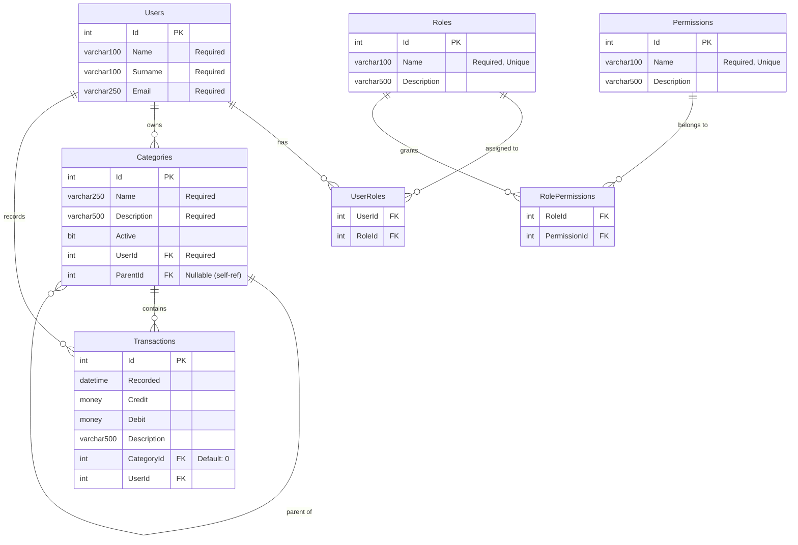

# MindedExample Database - ER Diagram

## Seeded Roles & Permissions

### Roles
| Role  | Description |
|-------|-------------|
| Admin | Full system access including user and role management |
| User  | Standard user with transaction management permissions |

### Permission Matrix
| Permission            | Admin | User |
|-----------------------|:-----:|:----:|
| CanCreateCategory     |   ✅  |  ❌  |
| CanCreateRootCategory |   ✅  |  ❌  |
| CanUpdateCategory     |   ✅  |  ❌  |
| CanDeleteCategory     |   ✅  |  ❌  |
| CanCreateTransaction  |   ✅  |  ✅  |
| CanUpdateTransaction  |   ✅  |  ✅  |
| CanDeleteTransaction  |   ✅  |  ✅  |
| CanCreateUser         |   ✅  |  ❌  |
| CanUpdateUser         |   ✅  |  ❌  |
| CanDeleteUser         |   ✅  |  ❌  |
| CanManageRoles        |   ✅  |  ❌  |
| CanAssignRoles        |   ✅  |  ❌  |
