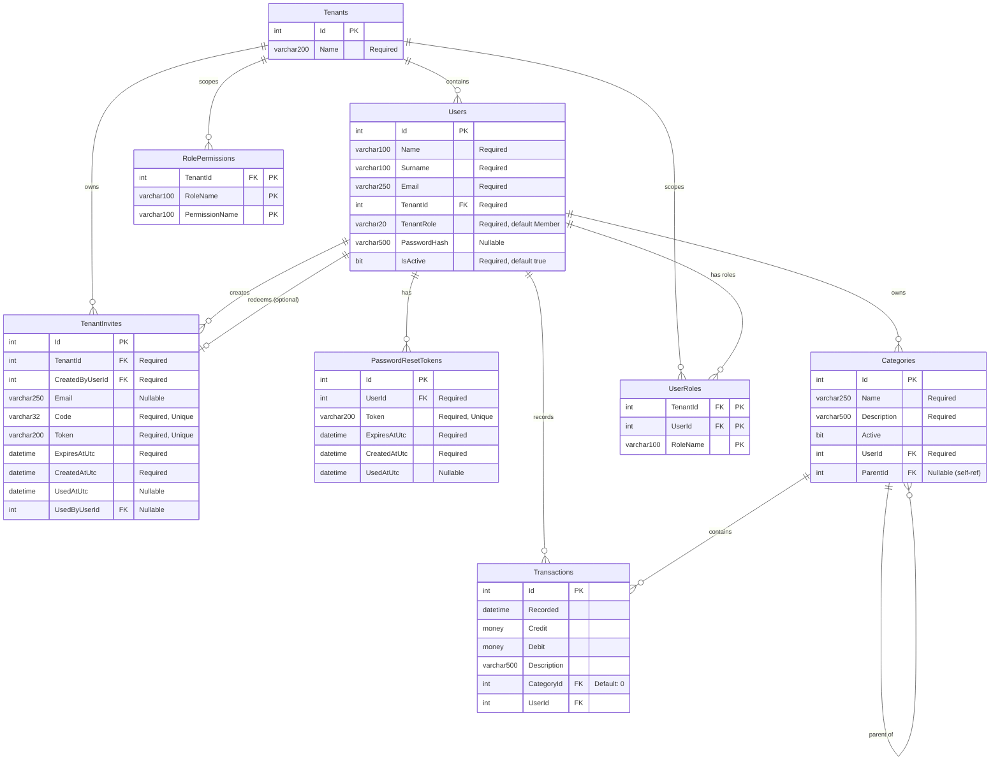

# MindedExample Database - ER Diagram

## Notes

- `Roles` and `Permissions` are no longer persisted as standalone tables.
- Role assignments are stored in `UserRoles` (`TenantId`, `UserId`, `RoleName`).
- Role-to-permission mappings are stored in `RolePermissions` (`TenantId`, `RoleName`, `PermissionName`).

## Seeded Roles & Permissions (Logical)

### Roles
| Role  | Description |
|-------|-------------|
| Admin | Full tenant-level access including member and role management |
| User  | Standard tenant member permissions |

### Permission Matrix
| Permission            | Admin | User |
|-----------------------|:-----:|:----:|
| CanCreateCategory     |   ✅  |  ❌  |
| CanCreateRootCategory |   ✅  |  ❌  |
| CanUpdateCategory     |   ✅  |  ❌  |
| CanDeleteCategory     |   ✅  |  ❌  |
| CanCreateTransaction  |   ✅  |  ✅  |
| CanUpdateTransaction  |   ✅  |  ✅  |
| CanDeleteTransaction  |   ✅  |  ✅  |
| CanCreateUser         |   ✅  |  ❌  |
| CanUpdateUser         |   ✅  |  ❌  |
| CanDeleteUser         |   ✅  |  ❌  |
| CanManageRoles        |   ✅  |  ❌  |
| CanAssignRoles        |   ✅  |  ❌  |
